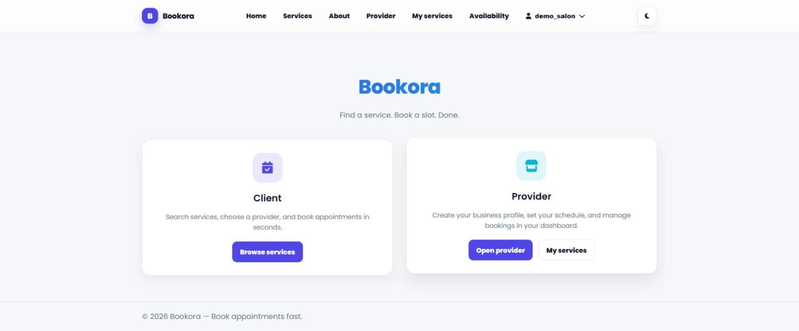
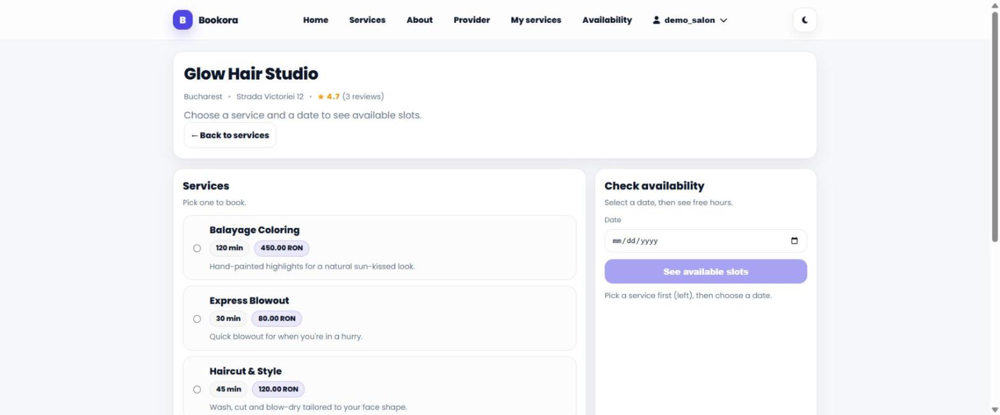
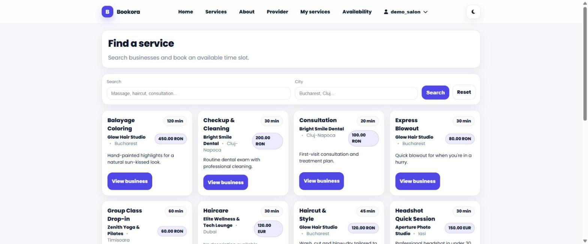
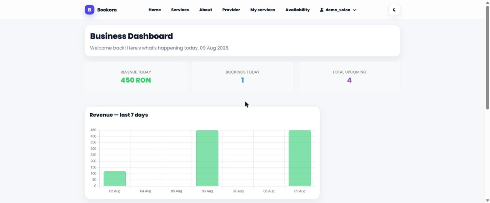

# 📅 Bookora - Smart Booking Simplified

**Bookora** is a modern appointment management platform built with Python and Django. The project is designed to eliminate the chaos of manual communication between service providers and clients, offering an automated, secure, and efficient solution.

🚀 **Live Demo:** https://bookora.onrender.com

[](https://github.com/SanduAndreea22/bookora/actions/workflows/ci.yml)

## Screenshots

| Marketplace | Business page |
|---|---|
|  |  |

| Search & filter | Provider dashboard |
|---|---|
|  |  |

## ✨ What does Bookora solve?

Have you ever calculated how much time you waste every week just trying to schedule a single appointment? Bookora puts an end to the "Are you free on Tuesday?" message ping-pong and places control directly in the user's hands.

### 👤 For Service Providers
- **Workspace Management:** Create and customize your business profile (name, city, address).
- **Service Configuration:** List your services with specific durations and pricing.
- **Automated Scheduling:** Define your weekly availability rules. Once set, your calendar fills itself.
- **Dedicated Dashboard:** Today's agenda, upcoming bookings and a 7-day revenue chart at a glance.

### 👥 For Clients
- **Find & Book:** Search for services and see real-time available slots.
- **10-Second Booking:** Pick a time, confirm, and you're done. No phone calls, no waiting.
- **Personal Management:** Access your booking history and the ability to cancel if plans change.
- **Reviews:** Rate and review a business after a completed booking.

## 🛡️ Architecture & Reliability

Behind a minimalist interface, Bookora uses robust backend logic to ensure an error-free experience:
- **Zero Double-Booking:** The system utilizes database-level atomic transactions (`select_for_update`) to guarantee that two people cannot book the same slot simultaneously.
- **Data Integrity:** Powered by PostgreSQL to ensure no appointment data is lost during server restarts.
- **User-Centric Roles:** Clearly defined roles (Provider vs. Client) for a logical and rapid user flow.
- **Automated tests + CI:** Core booking logic (overlap detection, slot generation) is covered by tests that run on every push via GitHub Actions.

## 🛠️ Tech Stack
- **Backend:** Python & Django, Django REST Framework
- **Database:** PostgreSQL (Neon Tech)
- **Deployment:** Render, Docker / docker-compose for local parity
- **Frontend:** Django Templates, Chart.js for the revenue chart
- **CI:** GitHub Actions

## Getting started locally

### Option A — Docker (recommended)

```bash
docker compose up --build
```

This starts the app on http://localhost:8000 with a Postgres database, running migrations automatically.

### Option B — Python venv

```bash
python -m venv venv
venv\Scripts\activate          # Windows
pip install -r requirements.txt
python manage.py migrate
python manage.py runserver
```

Copy `.env.example` to `.env` and adjust values as needed (a `SECRET_KEY`, `DEBUG`, and `ALLOWED_HOSTS` are enough to run locally with SQLite).

### Demo data

To populate the app with realistic sample businesses, services, bookings and reviews:

```bash
python manage.py seed_demo
```

This creates 4 demo businesses across different categories (hair salon, dental clinic, yoga studio, photo studio), each with services, a weekly schedule, past bookings with reviews, and a few upcoming bookings. All demo accounts use the password `demo12345`. The command is idempotent — safe to re-run. Use `--reset` to wipe and recreate the demo accounts.

## Deployment (Render)

`render.yaml` describes the service as a Blueprint (build/start commands, env vars, managed Postgres). The live demo already runs as a manually-configured Render service, so `render.yaml` won't apply automatically — to get the demo data on the live site, update the **Start Command** in the Render dashboard (Service → Settings) to:

```
python manage.py migrate && python manage.py seed_demo && gunicorn bookora.wsgi:application
```

`seed_demo` is idempotent, so it's safe to leave in the start command permanently — it only creates data the first time.

## REST API

A read-only API is available under `/api/` (built with Django REST Framework), useful for exploring the data model or building an alternative frontend:

- `GET /api/workspaces/` — list businesses with average rating
- `GET /api/workspaces/{slug}/` — business detail with active services
- `GET /api/workspaces/{slug}/reviews/` — paginated reviews
- `GET /api/workspaces/{slug}/slots/?service={id}&date=YYYY-MM-DD` — available booking slots

Browsable API available at `/api/workspaces/` when logged in via `/api-auth/login/`.

---
*Developed with ❤️ by Deea.*
